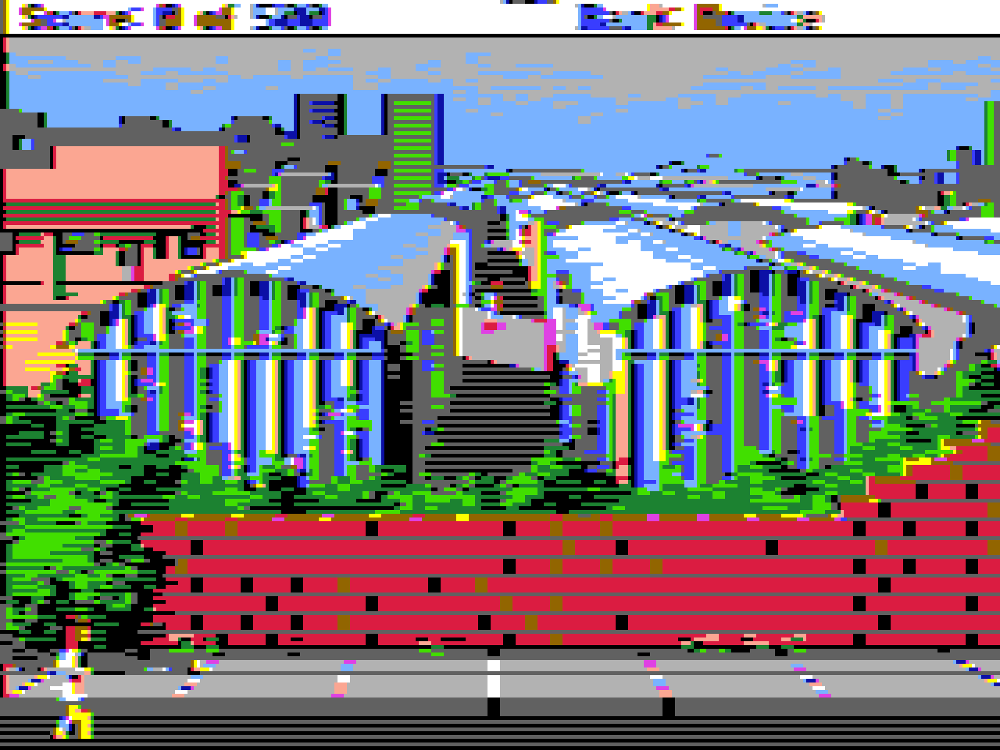
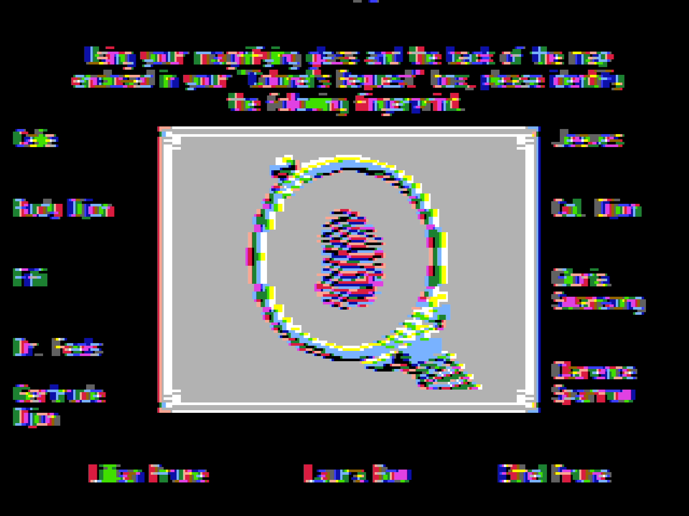
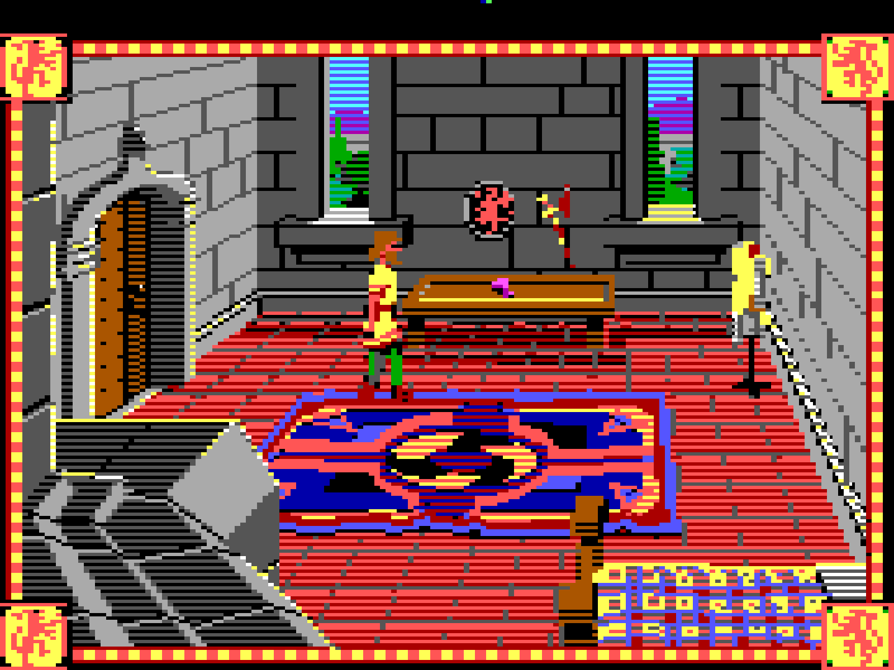
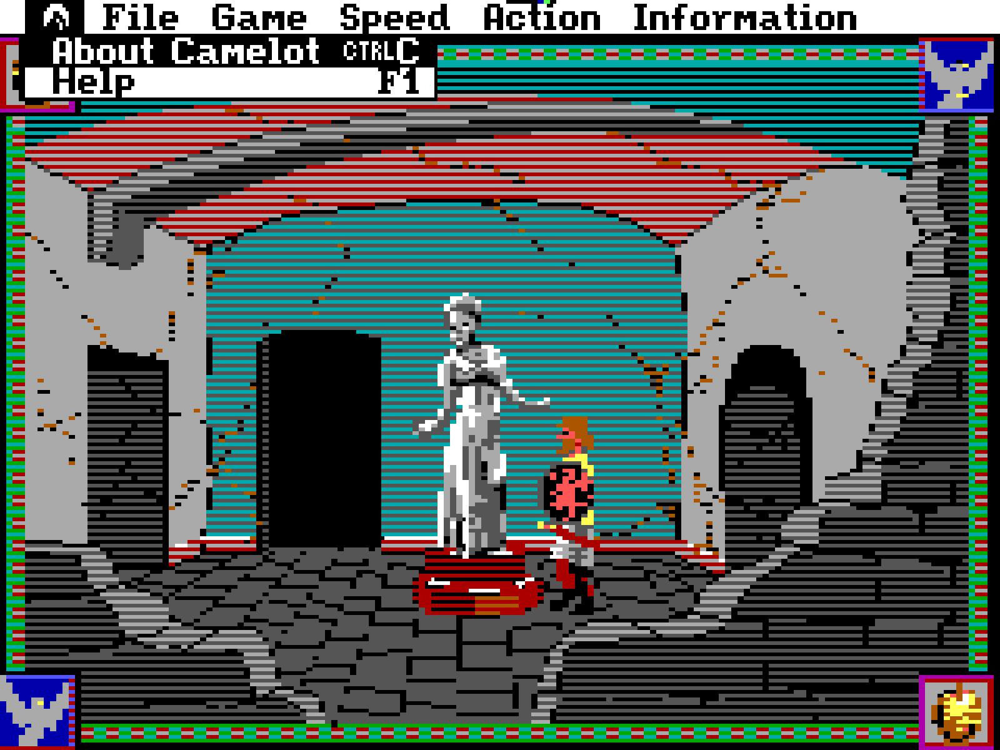
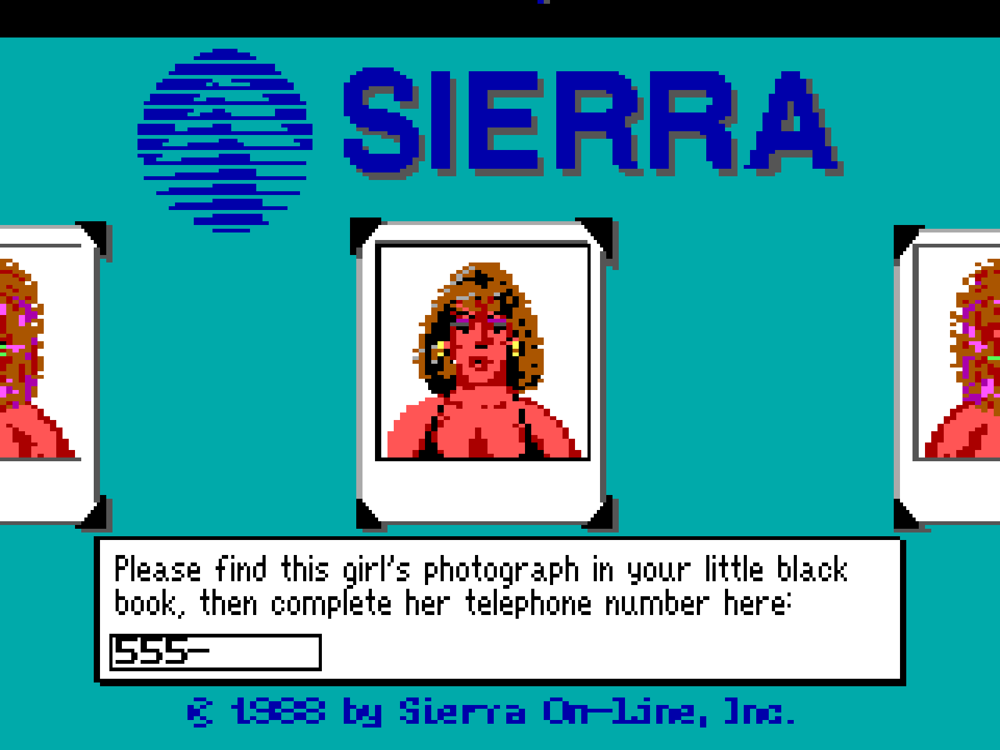
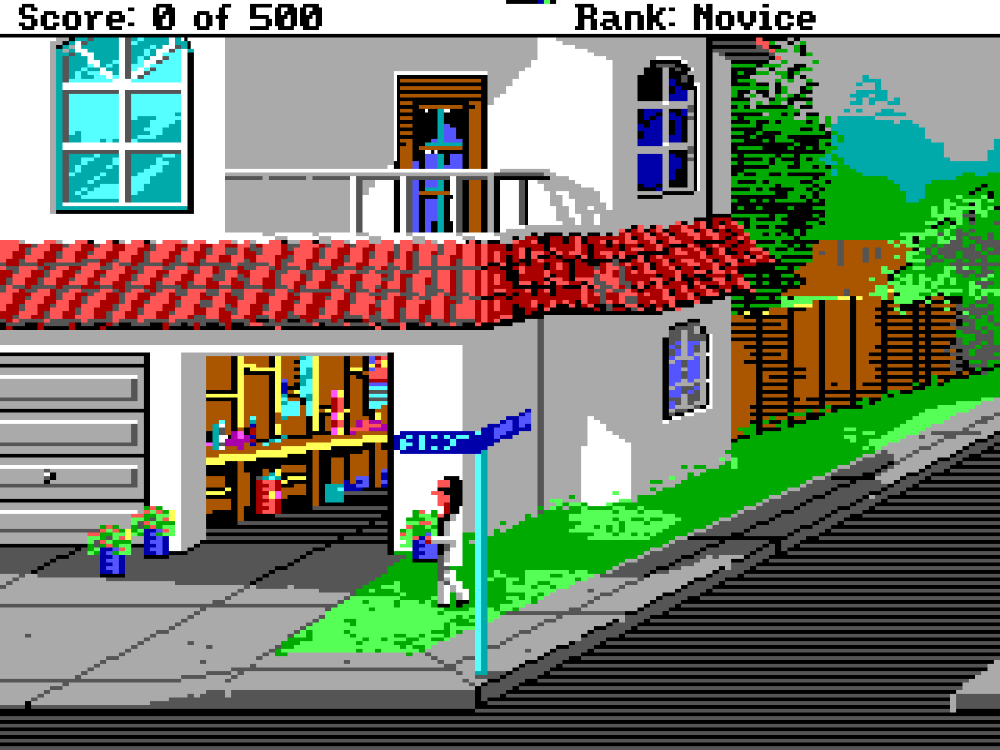
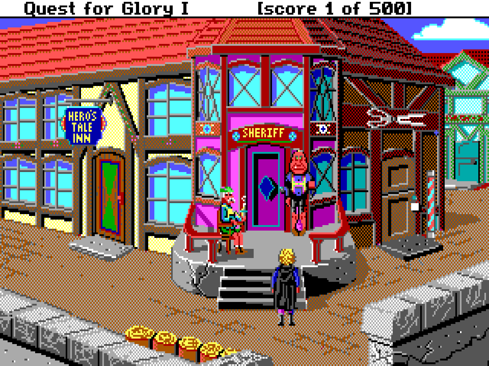
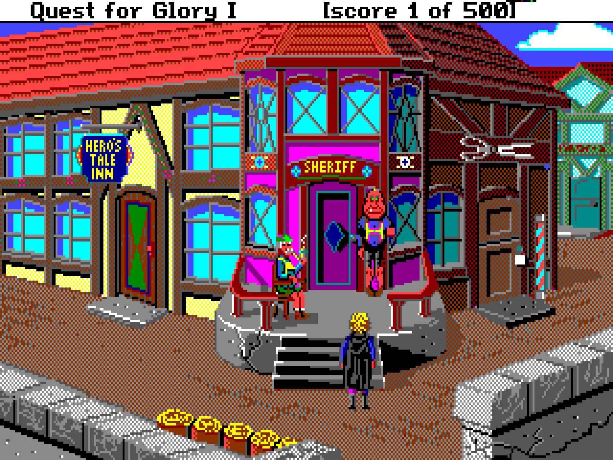
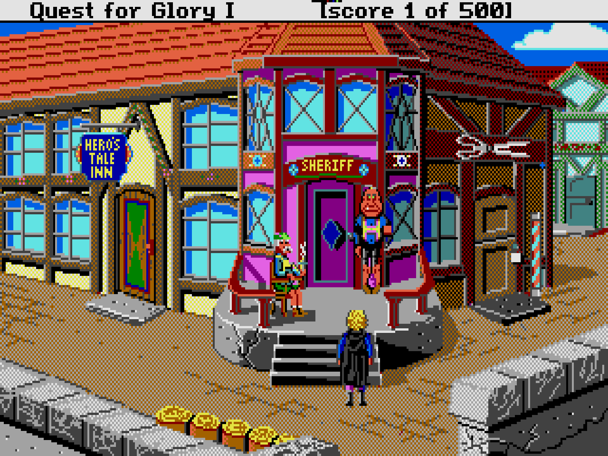
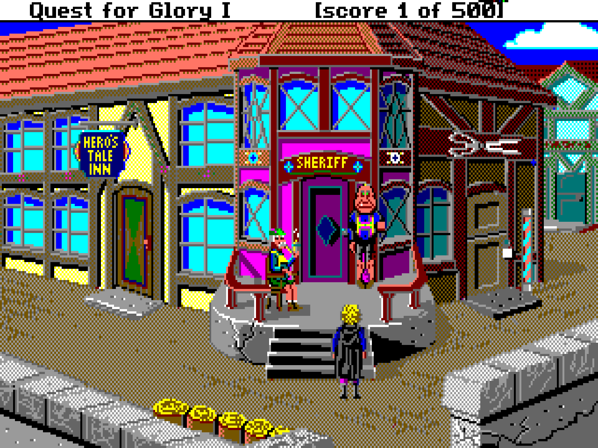

## Introduction

**glimsci** (/ˈɡlɪm.ski/) is a collection of VGA video drivers for Sierra Creative Interpreter (SCI) game engine. It provides multiple display modes with different palettes inspired by classic computer systems like the Amiga 500, PC-98, Atari ST, and other hacks.

Heads up, mouse code and screen shake are not implemented yet.

## Available Drivers

| Driver   | Description |
|----------|-------------|
| glim-a2  | Apple II DHGR-like at 320x200 |
| glim-agi | Downscale display to 160x200 to mimic old AGI games |
| glim-98  | Emulate PC-98 palette |
| glim-500 | Emulate Amiga 500 palette |
| glim-st  | Emulate Atari ST palette |

### Apple II DHGR-like (320x200)

Apple II's Double High Resolution Graphics is a video mode that supports 16 colors on color monitor, and yet renders beautifully on a black and white only monitor. The implementation here is a sliding window of 4 bits, so the color is affected by the 3 pixels to its left. This driver makes it really hard to read the text, so games cannot be completed using it. 

|||
|-|-|
| ||

### AGI Driver (Faux 160x200)

Downsample the original 320x200 display to 160x200. Resembling the aesthetics of the original AGI games. All it does is draw even pixels twice and drop odd pixels. You will notice that it keeps black and white pixels to make the text readable.

|||
|-|-|
| ||
| ||

### Custom Palettes: Amiga 500, Atari ST, PC-98

Click on an image to view in full resolution.

|||
|---|---|
| ||
|||

## How to Compile
To compile the drivers, you'll need:
- nasm
- make
- gcc

Run the following command in the project directory:
```make```

This will build all available drivers in the `drivers/` directory.

## Usage
To use a driver with your SCI game:

1. Copy driver or all drivers to your game directory
2. Run `INSTALL.EXE`, select the driver you want to use
3. Run your game

## License
This project is available under the LGPL License.

## Contact
Contact me at [@gilmegidish](https://x.com/gilmegidish) or [gil@megidish.net](mailto:gil@megidish.net)

## Credits
Big shoutout goes out to **Benedikt Freisen** for their work on reverse-engineering the SCI engine drivers. You can see the original work at [FOSS SCI Drivers](https://github.com/roybaer/foss_sci_drivers/).
